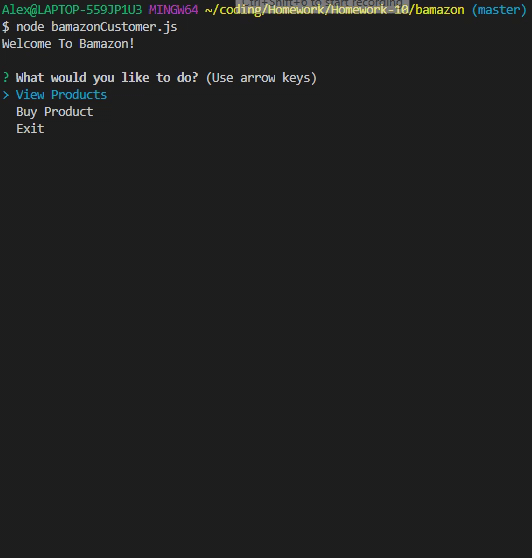

# bamazon

https://alexw519.github.io/bamazon/

For this app, there is a database of different products that you are able to interact with. Using this app, you are able to do actions such as "buying" a product or adding new invertory for a product depending on which javascript file you use. They are seperateed by position and different actions are avaiable for different postions. They are listed below.

## How To Run
To run this program, you just have to use one of the commands from above such as `node bamazonCustomer.js`. Then you will be presented with a menu, which you navigate by using the arrow keys, and then select your action from the list.

Inquirer is used to get input from the user, whether it be actual input or a selection from a list. And every command runs a different query with a products database, department database or with both.

#### Customer Page
`node bamazonCustomer.js`
With the first command, you are able to view everything in the inventory. It's important to note the ID as you will need to to buy a product.

With the second command, you are able to buy a product. First you will be prompted to enter in the Product ID, and then how much of the product that you would like. If there is sufficent quanity, you told how much your total is. Also, the amount bought will be removed from inventory, and the product sales will be updated.

On the left side is the view products for sale option from the manager page.

#### Manager Page
`node bamazonManager.js`

As you can see in the previous gif on the right side, the first option is to view the products for sale. Which is like the view products from the customer page, but there is also a quantity field. 

The second option is to view low inventory, which does the same thing as before, but only shows products with less than 5 left. 

The third option is to add to the inventory. With this one, if you put it the product id, you are able to put an amount of product to add to the quantity.

And the last option is to add a new product to the inventory. In this one, you just have to add the name, department name, price an quantity, and then it will be added to the inventory.

#### Supervisor Page
`node bamazonSupervisor.js`

The supervisor page enables you to do two more commands. The first being able to see the total sales between departments and no information is required.

The second option allows you to create a new departmen. But this time, you will only need the name and the over head costs. Which you are able to see towards the end of the previous gif.

## Technologies
Written in javascript, node.js & mySQL.
Uses mysql, inquirer & cli-table npm packages
